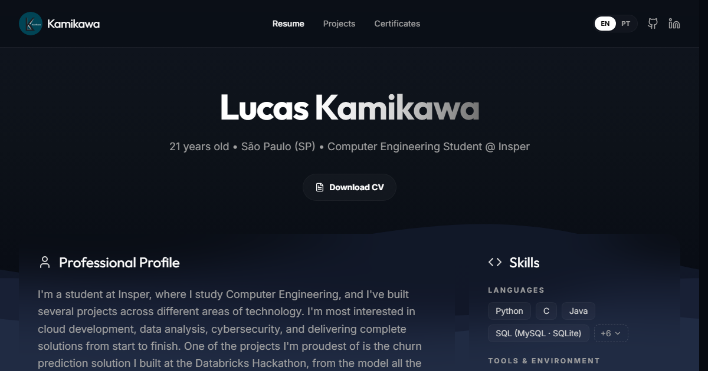

# Lucas Kamikawa · Portfolio

Personal portfolio of Lucas Kamikawa, Computer Engineering student at Insper (São Paulo).

**Live:** https://lucaskmk.github.io/

[](https://lucaskmk.github.io/)

## What's inside

- **Home:** profile, current internship, skills, featured projects and the CV in English and Portuguese.
- **Projects:** projects grouped by area (AI, data, cloud, backend, systems, cybersecurity and hardware), with links to code, demos and reports.
- **Certificates:** AWS, Google Cybersecurity and other certificates and badges, each one viewable in full size.
- **English and Portuguese:** the whole site switches language from the toggle in the header.

## Stack

React 19 · TypeScript · Vite · Tailwind CSS 4 · Motion · React Router · lucide-react

Hosted on GitHub Pages from the `gh-pages` branch.

## Running locally

```bash
npm install
npm run dev
```

The dev server runs at http://localhost:3000.

| Command | What it does |
|---|---|
| `npm run lint` | Type-checks the project |
| `npm run build` | Builds the site into `dist/` |
| `npm run deploy` | Builds and publishes `dist/` to the `gh-pages` branch |

## Where the content lives

- **Projects, certificates and CV text:** `src/constants.ts`
- **Project areas:** `src/areas.ts`
- **Images and CV PDFs:** `public/images` and `public/cv`
